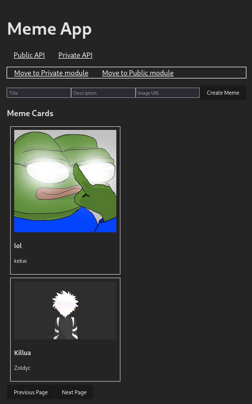

# `MADSOFT MEMESAPI [TEST]`

Веб-приложение для работы с коллекцией мемов.
___

## *Статус проекта*

***Завершен v0.0.1 &#10003;***


___
## Функциональность
#### Private API
- [GET] /api/v1/meme/urls: получить список всех ссылок на картинки мемов.
- [POST] /api/v1/meme/upload: добавить новый мем (картинку)

#### Public API
- [GET] /api/v1/meme: получить список всех мемов (с пагинацией).
- [GET] /api/v1/meme/{meme_id}: получить конкретный мем по его id.
- [POST] /api/v1/meme: добавить новый мем (с ссылкой на картинку и текстом).
- [PATCH] /api/v1/meme/{meme_id}: обновить существующий мем по его id.
- [DELETE] /api/v1/meme/{meme_id}: удалить существующий мем по его id.

## Технологии и фреймворки
- [Python 3.11.6](https://www.python.org/downloads/release/python-3116/)
- [FastAPI 0.108](https://fastapi.tiangolo.com/)
- [Uvicorn 0.25.0](https://www.uvicorn.org/settings/)
- [SQLAlchemy 2.0.25](https://docs.sqlalchemy.org/en/20/)
- [Alembic 1.13.1](https://alembic.sqlalchemy.org/en/latest/)
- [Pydantic 2.5.3](https://docs.pydantic.dev/latest/)
- Redis 7.2.5
- PostgreSQL 16
- Node 18.19.1
- Vite 4.4.5
- React 18.2.0
- TypeScript 5.0.2
- Docker 26.1.3
- Docker Compose 2.27.0
- [Pytest 8.1.1](https://doc.pytest.org/en/latest/announce/release-8.1.1.html)
- CI
___

## Запуск в dev mode

1. Clone the repository to the local machine

    ```shell
    git clone https://github.com/Segfaul/madsoft_testovoe.git
    ```

2. Build images and run app in dev mode

    ```shell
    docker compose -f docker-compose.dev.yml up -d --build
    ```

3. Checkout http://127.0.0.1:3000 (Vite), http://127.0.0.1:8000 (Uvicorn)
    
    ```shell
    # Also you may run tests if needed
    docker exec -it memes_app_dev-public_api-1 bash
    pytest backend/private_api/
    pytest backend/public_api/
    exit
    ```

5. Stop/Down the app

    ```shell
    # Without removing containers
    docker compose -f docker-compose.dev.yml stop

    # Removing containers
    docker compose -f docker-compose.dev.yml down

    # Removing containers and docker volumes (not local ones)
    docker compose -f docker-compose.dev.yml down -v
    ```
___

## Дополнительно

1. Добавлено общее логирование (log.ini + volumes).
2. Redis-cache для ускорения обработки частых запросов.
3. Добавлена пагинация с возможностью дополнительных сортировок по атрибутам :
    ```bash
    http://127.0.0.1:8000/api/v1/meme?limit=10&title
    http://127.0.0.1:8000/api/v1/meme?offset=2&limit=1&id
    ```
4. Добавлен полноценный клиент (React, Typescript).
___
